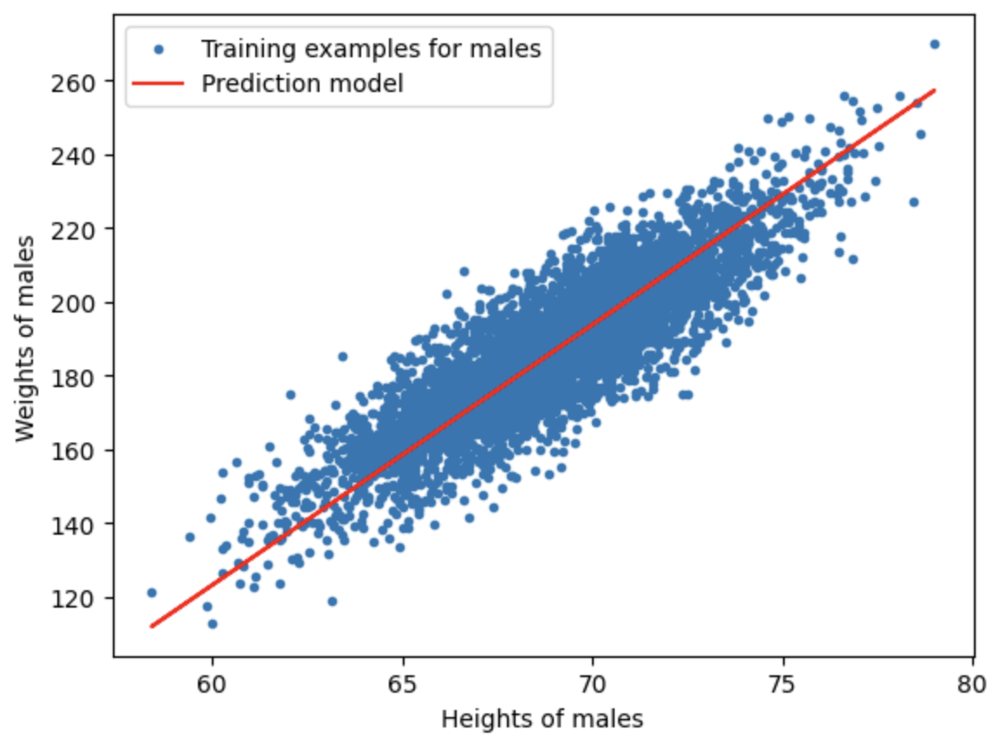
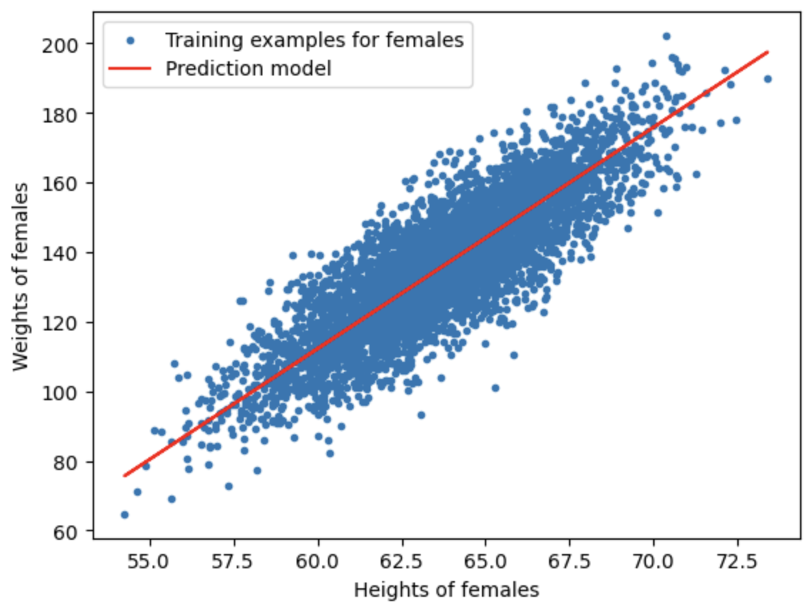

# WeightPrediction-LinearRegression
- This repository contains a Python implementation of a simple linear regression model to predict a person's weight based on their height. The dataset used in this project is weight-height.csv, which includes data for both males and females.
## Implementation Details
- The dataset is split into two categories: males and females.
- For each category, we calculate the optimal slope (w) and intercept (b) for the linear regression model using gradient descent.
- The cost function is minimized through iterations to achieve the best-fit line.
- Predictions are made for both males and females, and the results are visualized.
## Usage
1. Clone this repository to your local machine:
git clone https://github.com/yourusername/Weight-Prediction-Linear-Regression.git

2. Install the required dependencies:
pip install numpy pandas matplotlib

3. Run the Jupyter Notebook linear_regression.ipynb to see the code in action, including data preprocessing, model training, and visualization.
## Repository Structure
- linear_regression.ipynb: The Jupyter Notebook containing the code for the linear regression model.
- weight-height.csv: The dataset used for training and prediction.
- README.md: This readme file.
## Results
- The repository includes visualizations of the training points and fitted models for both males and females.

